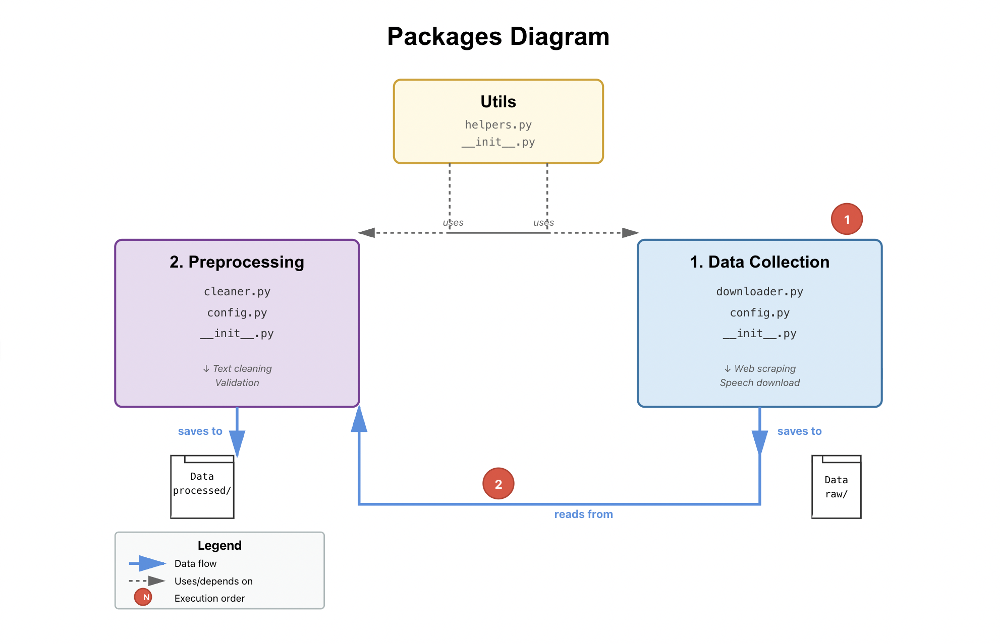

# DSAN-5400 Natural Language Processing Final Project 

**Team Members:** Erin Brzusek, Vinny Turtora, Sebastian Villalobos, Mohammad Yassin and Nikhil Patla

---

## Overview

This project examines rhetorical adaptation in political speech through computational linguistics. We analyze how figures like Bernie Sanders, JD Vance, and Ron DeSantis modify their language and sentiment based on audience and context.

## Installation

### Prerequisites
- Python 3.10 or higher
- Anaconda or Poetry (recommended)

### Setup

1. **Clone the repository**
```bash
git clone https://github.com/np767/5400_Final_Project.git
cd 5400_Final_Project
```

2. **Install the packages**

Using conda (recommended):
```bash
pip install -e packages/data_collection
pip install -e packages/preprocessing
pip install -e packages/utils
```

Using Poetry (for development):
```bash
cd packages/data_collection && poetry install && cd ../..
cd packages/preprocessing && poetry install && cd ../..
cd packages/utils && poetry install && cd ../..
```

3. **Download NLTK data** (if not already installed)
```python
import nltk
nltk.download('punkt')
nltk.download('wordnet')
nltk.download('stopwords')
```

### Verify Installation
```python
from data_collection import SpeechDownloader
from preprocessing import SpeechReader, SpeechCleaner

print("Installation successful!")
```

## Architecture
```
speech_sources.json (URLs by politician/context)
           ↓
    SpeechDownloader (data_collection)
           ↓
    data/raw/{politician}/{category}/
           ↓
    SpeechReader → SpeechCleaner (preprocessing)
           ↓
    data/processed/{politician}/{category}/
           ↓
    Analysis (sentiment, EDA, comparison)
```

**Packages:**
- `data_collection`: Web scraping with `SpeechDownloader`
- `preprocessing`: Text processing with `SpeechReader` and `SpeechCleaner`
- `utils`: Shared helper functions

## Quick Start

### 1. Configure Sources
Edit `data/config/speech_sources.json`:
```json
{
  "bernie_sanders": {
    "rally": ["url1", "url2"],
    "senate_floor": ["url3"],
    "bipartisan": ["url4"]
  }
}
```

### 2. Collect Data
```python
from data_collection import SpeechDownloader

downloader = SpeechDownloader()
downloader.download_all_speeches(download_file=True)
```

### 3. Preprocess Speeches
```python
from preprocessing import SpeechCleaner

cleaner = SpeechCleaner()

# Read speeches
speeches = reader.read_speeches(politician="bernie_sanders")

# Clean text
cleaned = cleaner.clean(raw_text)
```

## Key Features

- **Flexible data collection** via JSON configuration
- **Robust preprocessing** that preserves proper nouns, numbers, and sentence structure
- **N-gram extraction** for linguistic pattern analysis
- **Clean separation** between data validation and text processing
- **Poetry-managed packages** for reproducible environments

## Project Structure
```
5400_Final_Project/
├── packages/
│   ├── data_collection/        # Speech collection tools
│   ├── preprocessing/          # Text processing tools
│   └── utils/                  # Shared utilities
├── data/
│   ├── raw/                    # Original speeches
│   ├── processed/              # Cleaned speeches
│   └── config/                 # Configuration files
├── notebooks/                  # Analysis notebooks
└── scripts/                    # Standalone scripts
```



## Development

### Running Tests
```bash
cd packages/data_collection && poetry run pytest
cd packages/preprocessing && poetry run pytest
cd packages/utils && poetry run pytest
```

### Package Dependencies

**data_collection:**
- requests
- beautifulsoup4

**preprocessing:**
- nltk

## Linguistic Features

Source: https://huggingface.co/stanfordnlp/stanza-en

## Sentiment Analysis

Source: https://huggingface.co/blog/sentiment-analysis-python